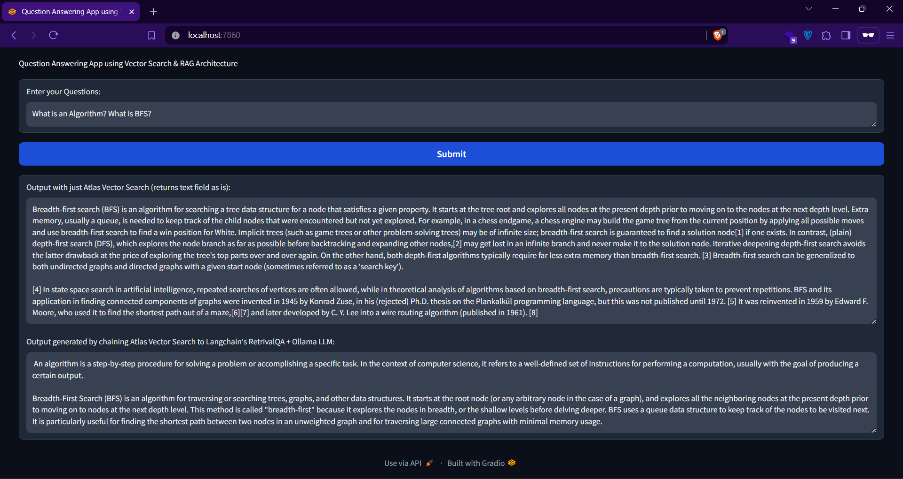

# GenAI RAG Text Explorer

**An implementation of RAG with Ollama Embeddings & Model (Mistral) over sample TXT files via Langchain wrapped as a Gradio Application**

STEPS TO RUN THIS APP:
- Run docker compose by `docker compose up`
- Wait for both containers to be ready, once it's live, check in the browser at port 7860.

Note: Don't forget to replace the env template with actual environment variables!

## Screenshot(s):

